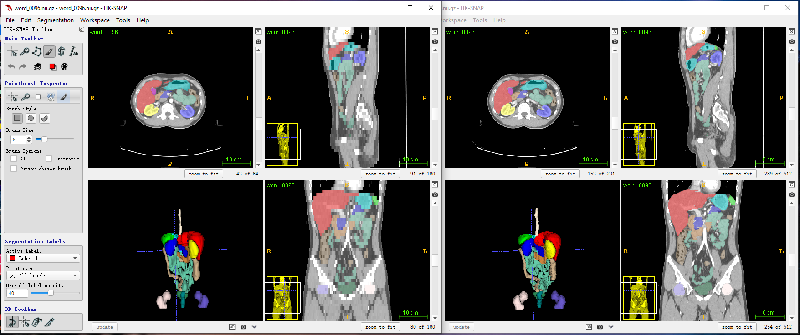

This repository contains source code for abdominal multi-organ segmentation in computed tomography (CT). The technical paper that describes the method is titled **Recurrent Feature Propagation and Edge Skip-Connections for Automatic Abdominal Organ Segmentation** [[arXiv]](https://arxiv.org/abs/2201.00317).

## CT Images Information

| Dataset                                                      | Description                                                  | Release date |
| ------------------------------------------------------------ | ------------------------------------------------------------ | ------------ |
| DenseVNet [[website]](https://zenodo.org/record/1169361#.ZAmIaHZByUk) | This dataset includes 90 CT images, 47 images from [the BTCV dataset](https://www.synapse.org/#!Synapse:syn3193805) and 43 images from [the TCIA dataset](https://wiki.cancerimagingarchive.net/display/Public/Pancreas-CT#225140407e328bff74a84d4885648246b4de92a4). Eight organ annotations and rib cage bounding boxes are provided. Annotated organs includes the **spleen, left kidney, gallbladder, esophagus, liver, stomach, pancreas and duodenum**. | 2018         |
| WORD [[website]]()                                           | WORD contains 150 CT images in total. Among them, 100 images is for training, 20 images is for validation, and 30 images is for testing. WORD extensively provides 16 annotated structures, including the l**iver, spleen, left kidney, right kidney, stomach, gallbladder, esophagus, pancreas, duodenum, colon, intensine, adrenal, rectum, bladder, head of left femur, head of right femur**. | 2022         |

## Data Preparation

We use the following steps to preprocess the datasets.

1. Align CT scans to the same orientation.
2. Crop CT scans to the regions of interest (ROIs) if the rib cage bounding boxes are available.
3. Resample CT scans to the size of 160X160X64.
4. Clip voxel intensities to the range of [-250, 200] HU.
5. Normalize voxel intensities to zero mean and unit variance.
6. Split CT scans into 4 folds for cross-validation.

Note that the second step (cropping CT scans to ROIs) is optional and the resampled size can be larger or smaller depending on how much GPU memory one can access to. Given the input size of 160X160X64, the intermediate features maps of our network occupy 10846 MB of GPU memory. 

<p style="text-align: center"> <b>Case 96 in the WORD training set. Left panel: resampled images and right panel: original images.</b></p>



## Training

We train segmentation models on the DenseVNet dataset and use the WORD dataset as an external validation dataset to see generalizability. 

We store data in the parent directory `/data/yzf/dataset/organct`. Shown below is the tree structure of the DenseVNet data folder. The `edge`, `preproc_img` and `preproc_label` folder contains edge maps, images, and ground truth labels respectively. The `cv_high_resolution.jason` file records cross-validation splits.

```
/data/yzf/dataset/organct
├── cv_high_resolution.json
├── btcv_high_resolution
│   ├── edge
│   ├── preproc_img
│   └── preproc_label
└── tcia_high_resolution
    ├── edge
    ├── preproc_img
    └── preproc_label
```

Show below is the tree structure of the WORD data folder. The `imagesVal` and `labelsVal` folders contain original images and labels. The `preprocessedval` folder contains preprocessed data as it is.

```
/data/yzf/dataset/organct/external
├── imagesVal
├── labelsVal
└── preprocessedval
    ├── image
    └── label
```

We implement two models in this codebase, the baseline model and our proposed model.  `train.py` is for the training of the baseline model. The following commands run the training program.

```
python train.py --gpu=0 --fold=0 --num_class=9 --cv_json='/path/to/DenseVNet/cross_validation.json'
```

`train_fullscheme.py` is for our proposed model. Commands to run the program are as follows.

```
python train_fullscheme.py --gpu=0 --fold=0 --num_class=9 --cv_json='/path/to/DenseVNet/cross_validation.json'
```

## Inference

Three metrics are used to quantify segmentation predictions. They are the Dice similarity coefficient (DSC), average symmetry surface distance (ASSD), and the 95*-th* percentile of Hausdorff distance (HD95). `inference.py` and `inference_external.py` predict validation segmentation volumes and compute evaluation metrics on the DenseVNet dataset and the external WORD dataset respectively.

```
python inference.py --gpu=0 --fold=0 --net=unet_l9_ds --num_class=9 --cv_json='/path/to/DenseVNet/cross_validation.json'
```

```
python inference_external.py --gpu=0 --fold=0 --net=unet_l9_ds --num_class=9 --cv_json='/path/to/WORD/cross_validation.json'
```

## Funtionality

`./models/utils_graphical_model.py` defines classes that construct 2D recurrent neural networks based on directed acyclic graphs.

## Citation

```
@article{yang2022recurrent,
  title={Recurrent Feature Propagation and Edge Skip-Connections for Automatic Abdominal Organ Segmentation},
  author={Yang, Zefan and Lin, Di and Wang, Yi},
  journal={arXiv preprint arXiv:2201.00317},
  year={2022}
}
```

